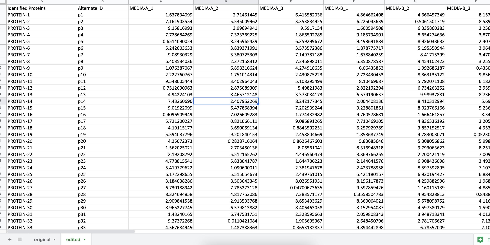

# Proteomics Analysis Tool

## What is it?

This tool was created for use by Deepika Awasthi's team at JBEI laboratories to automate proteomic analysis. It is a simple script that provides fold change values and p-values in an Excel sheet, and volcano plot figures.

## How to use

1. Clone this repo

   - If you have git installed, run `git clone git@github.com:adkala/portfolio.git`
   - Else, click the green 'Code' button on this page and click 'Download ZIP'
     - Unzip file before continuing

2. Install python3 if you don't have it

   - Can be downloaded from here https://www.python.org/downloads/

3. Install necessary packages

   - From terminal, navigate to this directory (use `cd ~/Downloads/proteomics_analysis` if in downloads)
   - Run `pip install -r requirements.txt`
     - if `pip` doesnt work, try `pip3`

4. Create 'edited' tab on Excel file according to these specifications:

   - 'Identified Proteins' column at column 1
   - 'Alternate ID' column at column 2
   - Protein values in columns 3 and beyond
   - Example Photo: 

5. Place Excel files in `proteomics_analysis` folder

   - This can be changed in the .env file with the `START_PATH` variable

6. From terminal, in `proteomics_analysis` folder, run `python3 prot.py *excel files* *denominator* *numerators*`
   - For example, to compare 'GLU' and 'HBA' against 'PCA' in KT2440_A.xlsx and KT2440_B.xlsx, run `python3 prot.py KT2440_A.xlsx,KT2440_B.xlsx PCA GLU,HBA`

### .env file

To edit variables such as start path, end path, and quantitative threshold, edit the .env file.

- If you can't see the .env file, enable hidden files in your file explorer.

### Have questions, feedback, or concerns?

Feel free to contact me at addikala@berkeley.edu. Would be happy to discuss!
